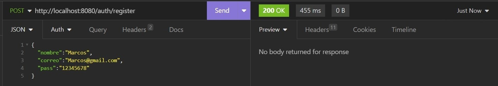
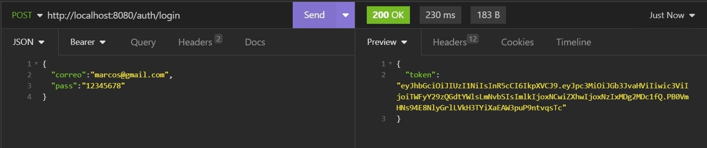
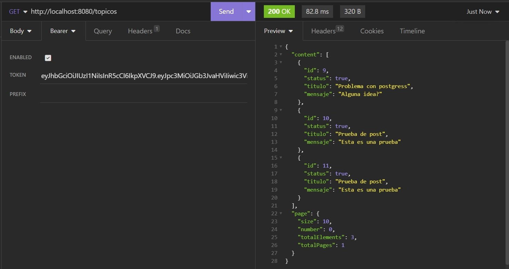

<h1>ForoHub</h1>

Api rest creada usando spring boot 3.3, MySql y documentada usando swagger para el curso de Oracle Next Education 
una vez iniciada la aplicacion podras acceder a la documentacion entrando al siguiente link <a href="http://localhost:8080/swagger-ui/index.html">Documentacion.</a> 
En caso de no poder acceder dejare adjuntas unas capturas para que puedas ver su funcionamiento. 
<h3>Register:</h3>
Primero debemos registrarnos con algun usuario como se muestra en la captura. 

<h3>Login:</h3>
Una vez registrados debemos loguearnos para poder obtener nuestro bearer token. 

<h3>Topicos</h3>
Ya una vez que tengamos nuestro bearer token, debemos colocarlo en el encabezado  
de nuestra peticion con el nombre de "Authorization" y podremos probar los distintos
endpoints que se encuentran en <a href="./src/main/java/com/alura/forohub/controller/TopicoController.java">TopicoController.java</a>

